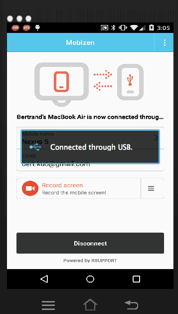

# Espresso Express

## Overview

This is a matchmaking application that matches coffee requesters who are willing to pay to have coffee delivered to them, with coffee deliverers who are willing to deliver coffee for a nominal fee.
Coffee requesters will select a nearby cafe and place a standing order.  The order has a nominal valid duration of 45 minutes.  Coffee Deliverers will take orders that look attractive/convenient to them.

## Required User Stories

* [x] Coffee Requesting User can choose a store
* [x] Coffee Requesting User can customize a drink order
* [x] Coffee Requesting User can specify their location
* [x] Coffee Requesting User can enter payment information
* [x] Coffee Requesting User can view their order
* [x] Coffee Requesting User can place their order
* [x] Coffee Requesting User can view their order status
* [x] Coffee Delivering User can choose an order to fill
* [x] Coffee Requesting User can see the location of the delivering user after the order is accepted

## Optional User Stores

* [ ] Users can do all of the above  **beautifully**
* [x] After order acceptance delivery user and requesting user can chat in realtime
* [ ] User can store common orders / payment information in a user profile.
* [ ] Stripe integration
* [ ] Starbucks barcode integration
* [x] Users may rate their counterparties
* [ ] Users may receive receipts / earnings advices through push notification.

