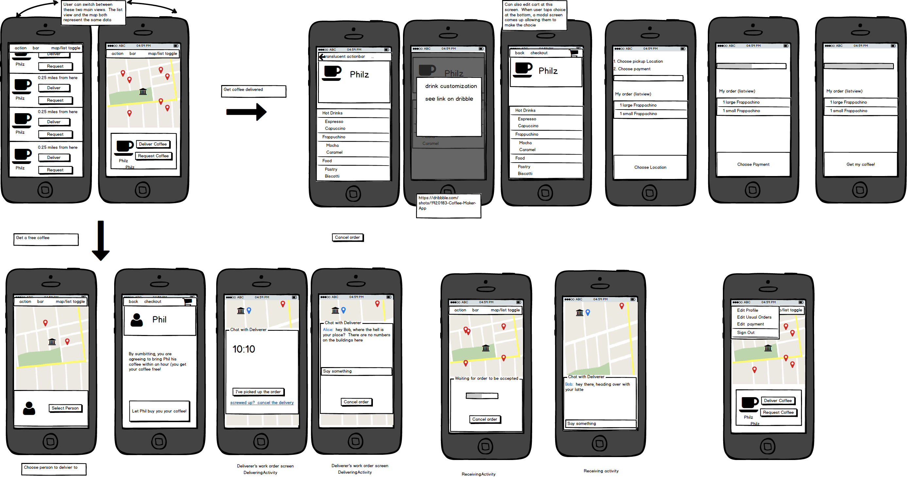

# Espresso Express

## Overview

This is a matchmaking application that matches coffee requesters who are willing to pay to have coffee delivered to them, with coffee deliverers who are willing to deliver coffee for a nominal fee.

## Required User Stories

* [ ] Coffee Requesting User can choose a store
* [ ] Coffee Requesting User can customize a drink order
* [ ] Coffee Requesting User can specify their location
* [ ] Coffee Requesting User can enter payment information
* [ ] Coffee Requesting User can view their order
* [ ] Coffee Requesting User can place their order
* [ ] Coffee Requesting User can view their order status
* [ ] Coffee Delivering User can choose an order to fill
* [ ] Coffee Requesting User can see the location of the delivering user after the order is accepted

## Optional User Stores

* [ ] Users can do all of the above  **beautifully**
* [ ] After order acceptance delivery user and requesting user can chat in realtime
* [ ] User can store common orders / payment information in a user profile.

